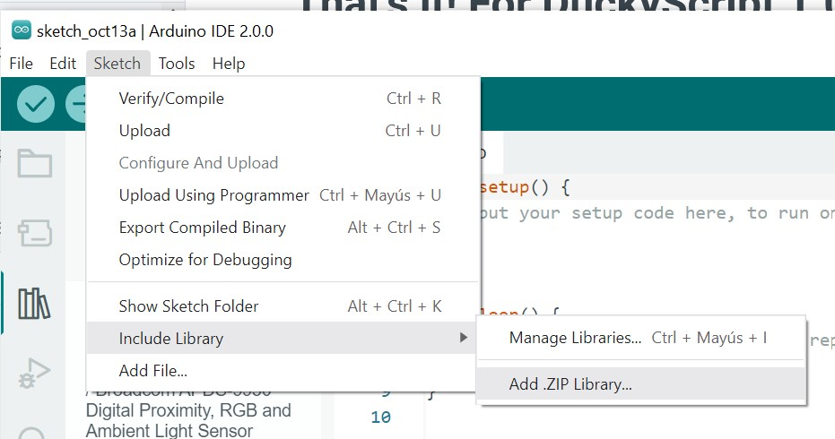
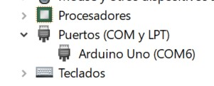
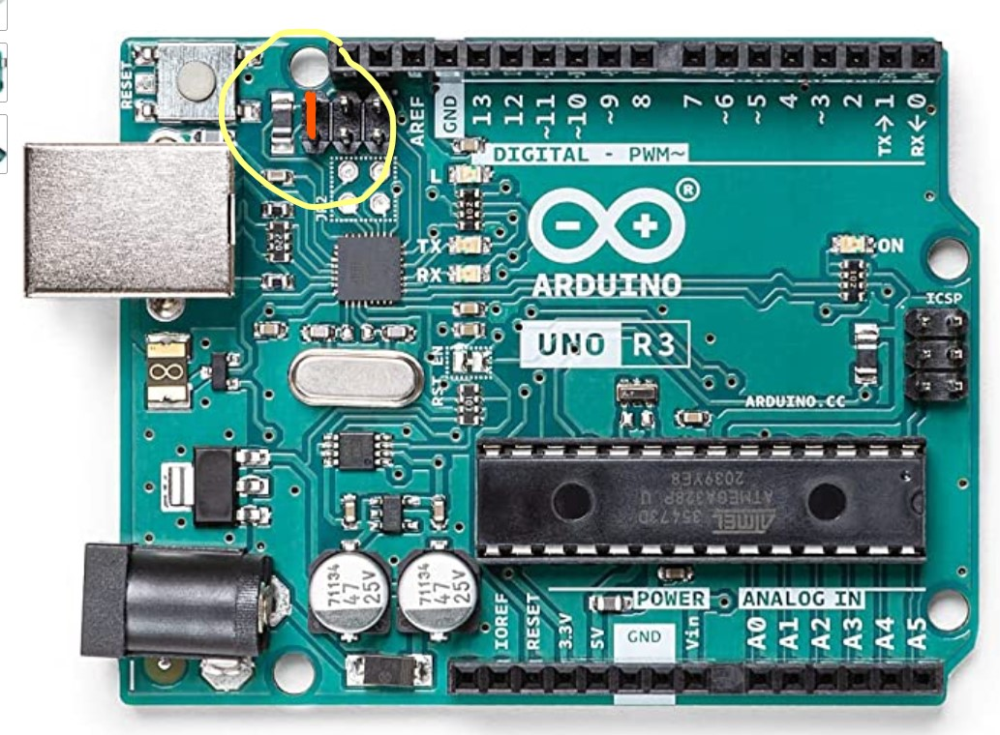
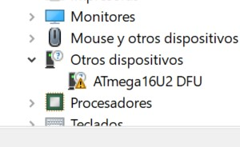

# RubberDucky

## Instalar librería UNO-HDKeyboard-Library-master

En nuestro Ardunino IDE instalamos la librería UNO-HDKeyboard-Library-master.zip

## Construir Payloads

..TO DO..

## Instalar Flip Installer

## Agregar Drivers ATmega 16U2 DFU

Para que aparezca el driver en el Administrador de dispositivos debemos pinchar el Aruduino UNO y ver que aparece como puerto de comunicaciones.

Sin desconectar el Arduino UNO puenteamos los pines más cercanos al puerto USB

Quitamos el puente, y veremos que en los dispositivos aparece el micro ATmega16U2 DFU

Instalamos los drivers desde c:\

# Activamos RubberDucky

# Activamos almacenamiento USB

## Enlaces de fuentes

https://create.arduino.cc/projecthub/aswinaK/rubber-ducky-using-arduino-593fb1

https://www.youtube.com/watch?v=tlYMNxC_Ptk

## DuckyScript

https://github.com/hak5darren/USB-Rubber-Ducky/wiki/Duckyscript

https://docs.hak5.org/hak5-usb-rubber-ducky/

https://dukweeno.github.io/Duckuino/