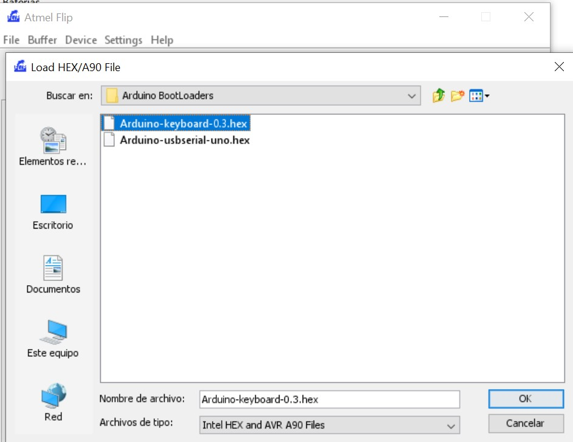
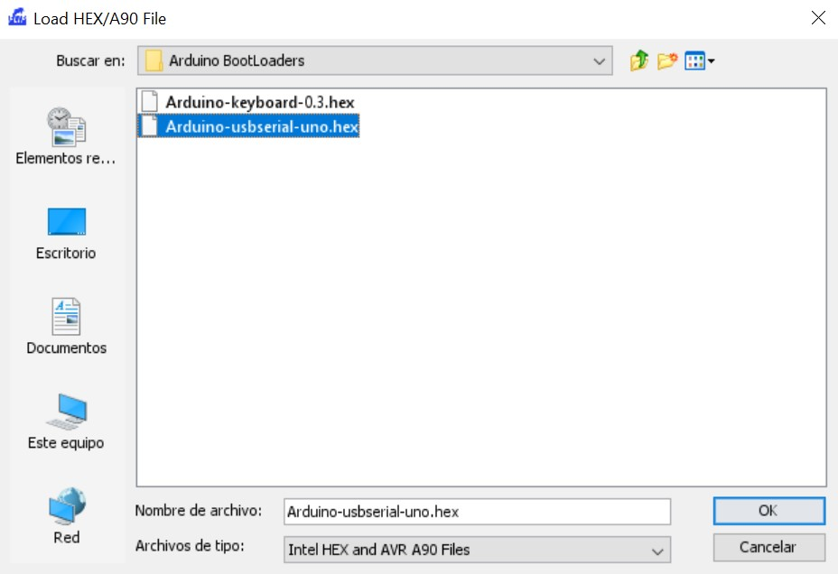

# RubberDucky

- [RubberDucky](#rubberducky)
  - [Instalar librería UNO-HDKeyboard-Library-master](#instalar-librería-uno-hdkeyboard-library-master)
  - [Construir Payloads](#construir-payloads)
    - [HIDKeyboard()](#hidkeyboard)
    - [begin()](#begin)
    - [pressKey(MODIFIER, KEY) / pressKey(KEY)](#presskeymodifier-key--presskeykey)
      - [MODIFIER](#modifier)
      - [KEY](#key)
    - [pressSpecialKey(MODIFIER, SPECIALKEY) / pressSpecialKey(SPECIALKEY)](#pressspecialkeymodifier-specialkey--pressspecialkeyspecialkey)
      - [SPECIALKEY](#specialkey)
      - [HID Values of Keypad Keys](#hid-values-of-keypad-keys)
      - [HID Values of System Keys](#hid-values-of-system-keys)
    - [releaseKey()](#releasekey)
    - [print(CADENA)](#printcadena)
    - [println(CADENA)](#printlncadena)
  - [Subir Payload a Arduino](#subir-payload-a-arduino)
  - [Instalar Flip Installer](#instalar-flip-installer)
  - [Agregar Drivers ATmega 16U2 DFU](#agregar-drivers-atmega-16u2-dfu)
  - [Activamos RubberDucky](#activamos-rubberducky)
  - [Activamos almacenamiento USB](#activamos-almacenamiento-usb)
  - [Fuentes](#fuentes)
- [Payloads All The Things](#payloads-all-the-things)
  - [DuckyScript](#duckyscript)

## Instalar librería UNO-HDKeyboard-Library-master

En nuestro Ardunino IDE instalamos la librería UNO-HDKeyboard-Library-master.zip

La librería adjunta se ha modificado con dos modificaciones que no se han actualizado en la web del desarrollador. 


## Construir Payloads

La librería UNO-HDKeyboard-Library-master dispone de los siguientes constructores:

### HIDKeyboard()

HIDKeyboard() se emplea para inicializar el objeto HIDKeyboard.

```
#include <HIDKeyboard.h> //Libreria
HIDKeyboard keyboard; // Inicializa objeto HIDkeyboard
```
### begin()

Inicializa el puerto de comunicaciones

```
keyboard.begin();
keyboard.begin(9600);
```

### pressKey(MODIFIER, KEY) / pressKey(KEY)

Envía pulsación de teclado, con sin modificador.
```
pressKey(CTRL, F1); // Pulsamos la tecla Ctrl+F1
pressKey(F1); // Pulsamos la tecla F1
```

#### MODIFIER

- CTRL / 0x01
- SHIFT / 0x02
- ALT / 0x04
- GUI / 0x08 // Tecla WIN

#### KEY

- F1 0x3a
- F2 0x3b
- F3 0x3c
- F4 0x3d
- F5 0x3e
- F6 0x3f
- F7 0x40
- F8 0x41
- F9 0x42
- F10 0x43
- F11 0x44
- F12 0x45

### pressSpecialKey(MODIFIER, SPECIALKEY) / pressSpecialKey(SPECIALKEY)

Envia TECLAS ESPECIALES, con o sin modificador. 

```
pressSpecialKey(SHIFT, INSERT); // Pulsamos Mays+Ins
pressSpecialKey(ENTER);  // Pulsamos Enter
```

#### SPECIALKEY

- ENTER / 0x28
- ESCAPE / 0x29
- BACKSPACE / 0x2a
- TAB / 0x2b
- SPACEBAR / 0x2c
- CAPSLOCK / 0x39
- PRINTSCREEN / 0x46
- SCROLLLOCK / 0x47
- PAUSE / 0x48
- INSERT / 0x49
- HOME / 0x4a
- PAGEUP / 0x4b
- DELETE / 0x4c
- END / 0x4d
- PAGEDOWN / 0x4e
- RIGHTARROW / 0x4f
- LEFTARROW / 0x50 
- DOWNARROW / 0x51
- UPARROW / 0x52
#### HID Values of Keypad Keys
- NUMLOCK / 0x53
- KEYPADSLASH / 0x54
- KEYPADSTAR / 0x55
- KEYPADMINUS / 0x56
- KEYPADPLUS / 0x57
- KEYPADENTER / 0x58
- KEYPAD1 / 0x59
- KEYPAD2 / 0x5a
- KEYPAD3 / 0x5b
- KEYPAD4 / 0x5c
- KEYPAD5 / 0x5d
- KEYPAD6 / 0x5e
- KEYPAD7 / 0x5f
- KEYPAD8 / 0x60
- KEYPAD9 / 0x61
- KEYPAD0 / 0x62
- KEYPADPERIOD / 0x63

#### HID Values of System Keys
- KEYBOARDAPPLICATION / 0x65
- KEYBOARDPOWER / 0x66
- VOLUMEMUTE / 0x7f
- VOLUMEUP / 0x80
- VOLUMEDOWN / 0x81

### releaseKey()
Libera la pulsación de la tecla.
```
pressSpecialKey(ENTER);  // Pulsamos Enter
releaseKey(); // Libera la pulsación de Enter
```
### print(CADENA)
Realiza la pulsación de teclado de la cadena que pasemos por parámetro.
```
pressSpecialKey(GUI); // Pulsamos la tecla Win
releaseKey(); // Liberamos la pulsación de la tecla WIN
print("cmd"); // Envia la pulsación de teclado "cmd", no es ncesario releaseKey()
printSpecialKey(ENTER); // Pulsamos Enter
```

### println(CADENA)
Realiza la pulsación de teclado de la cadena que pasemos por parámetro, y finaliza con ENTER.
```
pressSpecialKey(GUI); // Pulsamos la tecla Win
releaseKey(); // Liberamos la pulsación de la tecla WIN
println("cmd"); // Envia la pulsación de teclado "cmd+ENTER", no es ncesario releaseKey()
```

## Subir Payload a Arduino

Debemos comprobar que el "Administrador de dispositivos" detecta nuestro Arduino como un puerto de comunicaciones.


Si no fuese de este modo, desconectamos y conectamos nuestro Arduino del puerto USB

Arrancamos Arduino IDE, y subimos nuestro Payload.

## Instalar Flip Installer

Para instalar Flip Installer es necesario que tengamos instalado el JRE de Java

## Agregar Drivers ATmega 16U2 DFU

Para que aparezca el driver en el Administrador de dispositivos debemos pinchar el Aruduino UNO y ver que aparece como puerto de comunicaciones.


Sin desconectar el Arduino UNO puenteamos los pines más cercanos al puerto USB


Quitamos el puente, y veremos que en los dispositivos aparece el micro ATmega16U2 DFU


Actualizamos los drivers desde C:\Program Files (x86)\Atmel\Flip 3.4.7\usb


## Activamos RubberDucky

Una vez subido el Payload en nuestro Arduino, instalado FlipInstaler y agregado el driver Atmega16U2, modificamos el Bootloader para que nuestro Arduino UNO se comporte como un HID.

Arrancamos FlipInstaler y seleccionamos el driver ATmega16U2


Seleccionamos el puerto de comunicaciones, como USB


Abrimos el fichero que vamos a subir a nuestro Arduino.

File -> Load HEX File -> Arduino-keyboard-0.3.hex



Y subimos el cargador pulsando RUN


## Activamos almacenamiento USB

Para revertir el estado de nuestro Arduino y poder modificar el Payload:
Conectamos nuestro Arduino al PC para que ejecute el Payload

Puenteamos los pines más cercanos al puerto USB


Quitamos el puente, y veremos que en los dispositivos aparece el micro ATmega16U2 DFU


Arrancamos FlipInstaller

Seleccionamos el puerto de comunicaciones, como USB


Abrimos el fichero Arduino-usbserial-uno.hex

File -> Load HEX File -> Arduino-usbserial-uno.hex



Y subimos el contenido pulsando RUN


Desconectamos y conectamos nuestro Arduino de nuevo, y se reconocerá como PortCOM.

## Fuentes

https://create.arduino.cc/projecthub/aswinaK/rubber-ducky-using-arduino-593fb1

https://www.youtube.com/watch?v=tlYMNxC_Ptk

# Payloads All The Things

https://swisskyrepo.github.io/PayloadsAllTheThingsWeb/

## DuckyScript

https://github.com/hak5darren/USB-Rubber-Ducky/wiki/Duckyscript

https://docs.hak5.org/hak5-usb-rubber-ducky/

https://dukweeno.github.io/Duckuino/